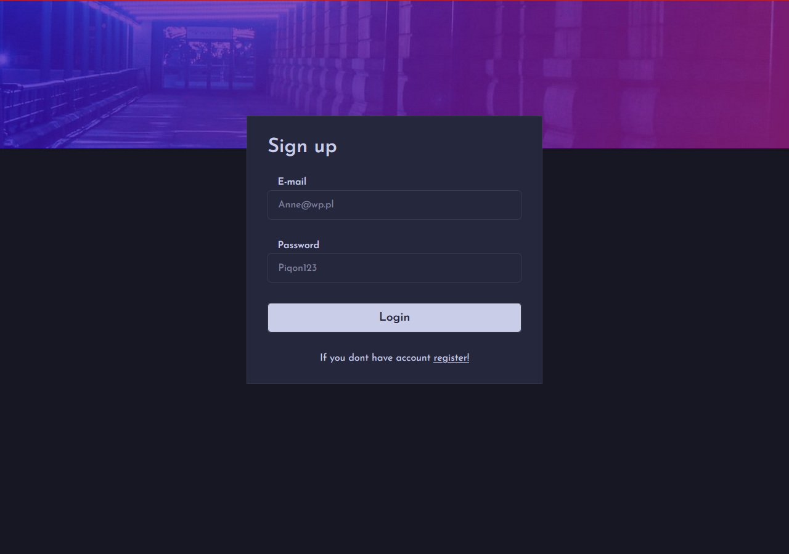
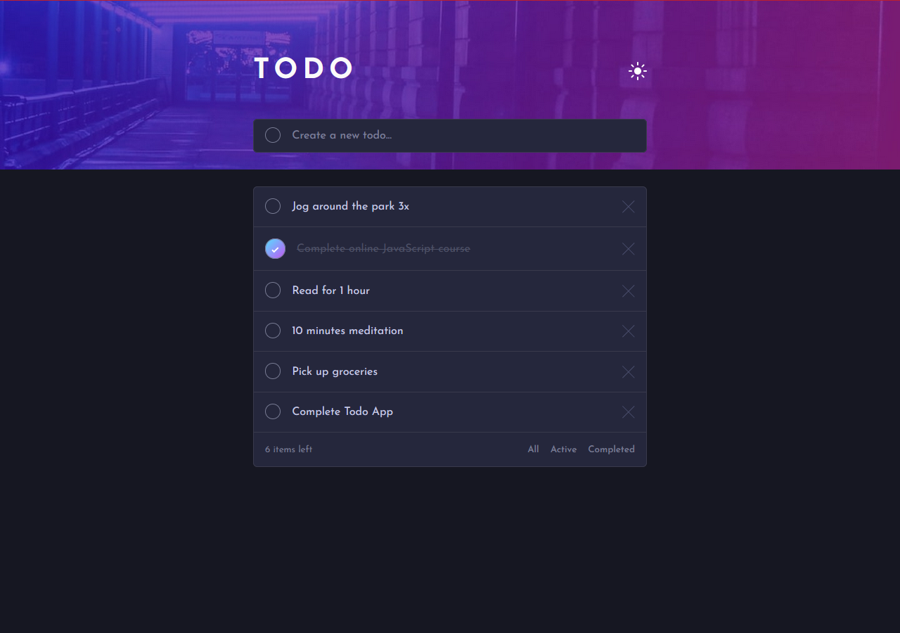

<p id="readme-top"></p>
<div align="center">
  <h3 align="center">PIQ Tasks</h3>

  <p align="center">
     Log in and create tasks you don't want to forget!
    <br />
    <br />
    <a href="https://piq-tasks.vercel.app/">View a project demo</a>
  </p>




</div>

<!-- TABLE OF CONTENTS -->
<details>
  <summary>Table of Contents</summary>
  <ol>
    <li>
      <a href="#about-the-project">About The Project</a>
      <ul>
        <li><a href="#built-with">Built With</a></li>
      </ul>
    </li>
    <li>
      <a href="#getting-started">Getting Started</a>
      <ul>
        <li><a href="#installation">Installation</a></li>
      </ul>
    </li>
  </ol>
</details>

<!-- ABOUT THE PROJECT -->

## About The Project

You have the option to log in and register taking into account the user's private tasks.
We allow you to edit, add, delete tasks.
In addition, you have the option to change the color theme.

<p align="right">(<a href="#readme-top">back to top</a>)</p>

### Built With

Technologies used:

- 
- 
- 
- 
- 
- 
- 
- 
- 

<p align="right">(<a href="#readme-top">back to top</a>)</p>

<!-- GETTING STARTED -->

## Getting Started

### ENVIRONMENT VARIABLES

You need to add environment variables supporting config firebase.

```sh
  VITE_FIREBASE_APIKEY - FIREBASE APIKEY
  VITE_FIREBASE_AUTHDOMAIN - FIREBASE AUTHDOMAIN
  ITE_FIREBASE_PROJECTID - FIREBASE PROJECTID
  VITE_FIREBASE_STORAGEBUCKET - FIREBASE STORAGEBUCKET
  VITE_FIREBASE_MESSAGINGSENDERID - FIREBASE MESSAGINGSENDERID
  VITE_FIREBASE_APPID - FIREBASE APPID
  VITE_FIREBASE_MEASUREMENTID - FIREBASE MEASUREMENTID
```

### DEMO ACCOUNt

```sh
  email:test123@wp.pl
  password:123456
```

### RUN A PROJECT

1. Run server

```sh
  npm run dev
```

2. Run test

```sh
  npm run test
```

<p align="right">(<a href="#readme-top">back to top</a>)</p>
